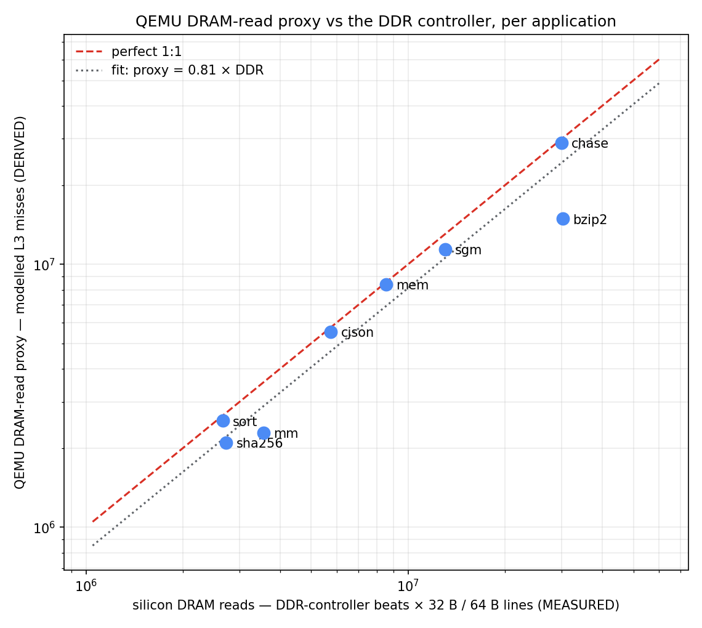

# wattson

**Dead-reckoning silicon power from QEMU activity — with the activity half now
validated against real silicon.**

*Watt* (power) + *Watson* (deduce the unknown from the evidence). Dead reckoning
is navigating from known speed and heading when you have no fix on land — which
is exactly what this does: estimate a chip's power from activity proxies when
the silicon doesn't exist yet, or can't be instrumented.

---

## The one idea

> **QEMU supplies the activity (α). The power engineers supply the energy-per-event.**

QEMU is a *functional* emulator: it knows *what* a workload does — instructions
retired, memory transactions, which blocks are busy and for how long — and
nothing about *how* the silicon does it (no gates, no capacitance, no leakage,
no DVFS residency). So wattson never computes power and never emits watts. It
produces the **activity** half of `P ≈ Σ (energy_per_event × event_count)`;
the power team owns the **energy** half — the same coefficients behind
"if your activity factor is 5%, core power is XYZ." That division of labour is
what makes the estimate defensible, and what lets it extend to a chip that only
exists in QEMU.

## Does it actually track silicon? Yes — measured.

The load-bearing question was never the plumbing; it was whether a functional
emulator's counts *correlate* with what silicon does. `xcheck/` answered it:
**fourteen applications** (microbench corners plus stereo vision on real
imagery, bzip2, lz4, Lua, SHA-256, cJSON, an in-memory SQLite workload, a
genetic-AI Pac-Man trainer, and a live-socket HTTP client), the **same static
aarch64 binaries** run under QEMU's TCG plugins and on i.MX95 silicon
(A55 PMUs + the DDR-controller counters):

| quantity | result |
|---|---|
| **Instructions, per core** | QEMU/silicon = **0.98 – 1.06 on all 14 apps** (0.997 on a 10.2-billion-instruction vision app) |
| **DRAM read traffic** | proxy = **0.81 × silicon, spread ×/÷ 1.26** across every app above the DDR counter's noise floor |
| **DRAM-quiet screening** | the five low-traffic apps are correctly *classified* quiet |
| **DRAM writes** | streaming class modelled (0.80); scattered-write writeback model is the named next step |



Three instrument lessons from the campaign, free to anyone doing this kind of
work: the A55 PMU's `l3d_cache_refill` counts only **demand** refills (prefetched
lines bypass it — ground-truth DRAM at the DDR controller, not inside the cache
hierarchy); the A55's **write-streaming** (no-allocate) mode is a clean 2.0×
error if unmodelled; and a userspace-only emulation cannot see the ~20% of a
network app's instructions the kernel retires on its behalf — quantified, not
hand-waved. Full evidence: [`xcheck/RESULTS.md`](xcheck/RESULTS.md) and the
regenerable deck [`xcheck/xcheck-correlation.pptx`](xcheck/xcheck-correlation.pptx).

## The phases

| Phase | Who supplies activity | Who supplies energy | Output |
|---|---|---|---|
| **P0 — activity** *(built)* | wattson (QEMU TCG plugins) | — | activity vectors (JSON, schema'd) |
| **xcheck — validate** *(done)* | wattson vs i.MX95 PMUs/DDR counters | — | the correlation above + correction factors |
| **P1 — calibrate** *(needs instrumented board)* | wattson, on i.MX95 | measured per-rail silicon power | fitted energy-per-event + error band |
| **P2 — the next chip** | wattson, on the QEMU model of an unbuilt chip | the power team's model for that chip | pre-silicon power estimate for QEMU-visible blocks |

**Golden rule for P2:** reuse the *activity-extraction methodology* on the new
chip, **never** the *energy coefficients* fitted on i.MX95 — different
node/uarch. Borrow the α, not the joules.

## What it measures (and what it can't)

**Measures well** — QEMU-visible, activity-driven blocks: per-core instruction
work and active-vs-halted duty; DRAM transactions via a silicon-matched
functional cache model (three levels + write-streaming — geometry read from the
target's own sysfs); block-active duty for accelerators QEMU models.

**Cannot measure** — own these on the energy side: leakage, microarchitectural
effects (speculation, pipeline, DVFS residency), analog/PLLs/PHYs/always-on.

**Honest accuracy:** block-level, calibrated, cache model included — expect
roughly **±20%**. For pre-silicon architectural exploration and
"which use-case is the hog"; **not** for power signoff.

## Quickstart

Activity vector from a bare-metal workload on the i.MX95 machine model
(needs a QEMU built with `-Dplugins=true`):

```sh
bash harness/run-activity.sh workloads/bench-mem.bin bench-mem "256MiB stream" > my.activity.json
```

Cross-check any Linux userspace binary against silicon (see
[`xcheck/README.md`](xcheck/README.md); apps rebuild via
[`xcheck/apps/BUILD.md`](xcheck/apps/BUILD.md)):

```sh
xcheck/run-qemu.sh mylabel -- ./my-static-app args   # QEMU side (host)
xcheck/run-perf.sh mylabel -- ./my-static-app args   # on the board
xcheck/run-ddr.sh  mylabel -- ./my-static-app args   # on the board (DDR PMU)
xcheck/compare.py                                    # ratios + fitted factor
```

## Layout

```
wattson/
  harness/          P0: run a workload under the plugins -> activity vector (JSON)
  schema/           activity-vector JSON schema
  workloads/        bounded bare-metal workloads (PSCI-off so plugins flush)
  samples/          real activity vectors
  xcheck/           the QEMU-vs-silicon validation: harnesses, 14-app suite,
                    measured vectors (out/), RESULTS.md, the deck + its generator,
                    and the QEMU cache-plugin patch (3-level + write-streaming)
  calibrate/        P1: regress activity vs measured rail power (stub + how-to,
                    anchored to NXP's public AN14449 procedure and rail map)
  docs/             methodology, roadmap
```

## Provenance rules (non-negotiable)

Every number carries a tag. **MEASURED** = ran on silicon with proof.
**DERIVED** = computed from a model or measurement — always labelled.
**SOURCED** = vendor/datasheet — always labelled. A DERIVED or SOURCED number is
never compared against a MEASURED one as if equal, a QEMU count is never called
a silicon measurement, and wattson never emits watts.
