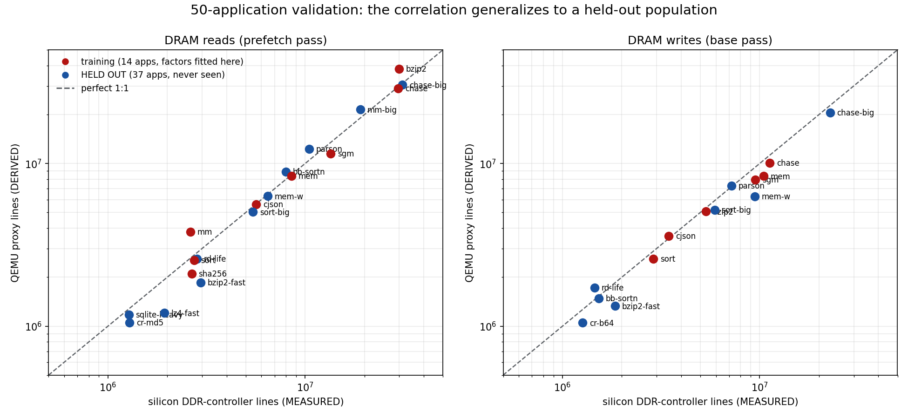

# wattson

**Dead-reckoning silicon power from QEMU activity — with the activity half now
validated against real silicon.**

*Watt* (power) + *Watson* (deduce the unknown from the evidence). Dead reckoning
is navigating from known speed and heading when you have no fix on land — which
is exactly what this does: estimate a chip's power from activity proxies when
the silicon doesn't exist yet, or can't be instrumented.

---

## The one idea

> **QEMU supplies the activity (α). The power engineers supply the energy-per-event.**

QEMU is a *functional* emulator: it knows *what* a workload does — instructions
retired, memory transactions, which blocks are busy and for how long — and
nothing about *how* the silicon does it (no gates, no capacitance, no leakage,
no DVFS residency). So wattson never computes power and never emits watts. It
produces the **activity** half of `P ≈ Σ (energy_per_event × event_count)`;
the power team owns the **energy** half — the same coefficients behind
"if your activity factor is 5%, core power is XYZ." That division of labour is
what makes the estimate defensible, and what lets it extend to a chip that only
exists in QEMU.

## Does it actually track silicon? Yes — measured, then held-out-validated on 50 apps.

The load-bearing question was never the plumbing; it was whether a functional
emulator's counts *correlate* with what silicon does. `xcheck/` answered it in
two acts. **Act one**: fourteen applications, same static aarch64 binaries
under QEMU's TCG plugins and on i.MX95 silicon (A55 PMUs + the DDR-controller
counters), iterated mechanism-by-mechanism — a silicon-matched three-level
cache with A55-style write-streaming (X1), a stream-table prefetcher (X4), a
writeback model, boot-differential system-mode runs (X2), and a 13-point SMP
sweep (X3). **Act two**: those fitted corrections were then tested against
**36 additional applications the model had never seen** — busybox applets,
crypto kernels, software renderers, a genetic-AI Pac-Man, JSON/bignum/database
workloads:

| quantity | fitted (14 apps) | **HELD OUT (36 new apps)** |
|---|---|---|
| **Instructions, per core** | 0.998 ×/÷ 1.02 | **0.979 ×/÷ 1.04** (n=37 runs) |
| **DRAM reads** (prefetch pass) | 1.01 ×/÷ 1.21 | **0.91 ×/÷ 1.21 — identical spread** |
| **DRAM writes** (writeback pass) | 0.90 ×/÷ 1.09 | 0.83 ×/÷ 1.28 |
| **DRAM-quiet screening** | 5/5 correct | **every quiet app correctly classified** |



**The verdict, since a campaign that never concludes is just data:** *yes* — a
user can point a tool at an application nobody has measured and get activity
factors that match silicon, for **CPU and DRAM activity on a non-accelerated
workload**, within the bands in that table. Instructions need no correction at
all; reads take ×1.02 and carry ×/÷1.21; writes take ×1.11 and carry ×/÷1.28.
Kernel instructions are **in scope, not excluded** — the system-mode harness
measures user + kernel together by boot-differential (sha256's kernel share:
10.0%; a networking workload's: 16.7%). Today's real boundaries are narrower
than they look: **accelerator compute** (QEMU does not execute GPU/VPU/NPU work,
so there is no activity to count — a Neutron NPU model is in build, and a GPU
activity scope off the GLES command stream is the next investigation), **DMA
payload bytes** (a device model writes guest memory without going through TCG,
so no CPU-side plugin sees it — the bytes are known exactly to the device model,
making this an instrumentation gap rather than an unknown), and **core identity
and DVFS state**, which QEMU has no notion of and which belong to the power
model.

Power itself was never in scope and is not a limitation: wattson supplies **N**,
the power team supplies **eᵢ**, and the deliverable is a counts-per-run vector
that drops into their spreadsheet as the N column of `E = Σ eᵢ×Nᵢ`.

That the two halves combine is the whole argument: **deep** earned the
corrections (14 apps, mechanism by mechanism, five falsified hypotheses),
**broad** proved they are not curve-fits (36 apps, measured cold). Deep alone
would be a tuned demo; broad alone would be a coincidence. Multi-core survives too (DRAM ratios
thread-invariant across a 1/2/4/6-thread sweep; the one +23% instruction
outlier was *proven* to be OpenMP barrier spin — passive waiting collapses it
to 0.985). Kernel share is measurable by boot-differential (sha256: 10.0%
over user mode), and network DMA's visibility boundary is characterized, not
hand-waved.

Instrument lessons from the campaign, free to anyone doing this kind of work:
the A55 PMU's `l3d_cache_refill` counts only **demand** refills (prefetched
lines bypass it — ground-truth DRAM at the DDR controller, not inside the
hierarchy); the A55's **write-streaming** mode is a clean 2.0× error if
unmodelled; scattered writes leave DRAM as **dirty evictions** no
allocation-time count can see; OpenMP **spin-wait instructions are timing, not
work**; and a userspace-only emulation cannot see kernel or DMA activity —
each quantified, several falsified-and-recorded on the way. Full evidence:
[`xcheck/RESULTS.md`](xcheck/RESULTS.md) and the regenerable deck
[`xcheck/xcheck-correlation.pptx`](xcheck/xcheck-correlation.pptx).

## Fifty apps in, fifty activity factors out

The user-facing product is [`afgen/`](afgen/): write a manifest of
`<label> <command>` lines, run one script, get one activity-factor JSON per
application plus a summary table — counts per run (what
`E = Σ energy_i × count_i` consumes), extracted in two passes so reads come
from the prefetcher model and writes from the writeback model, every field
provenance-tagged with the corrections and their bands:

```sh
afgen/afgen.sh my-apps.manifest afs/
```

Rates need a duration only the power team can supply; the JSON says so
explicitly. Per-target calibration (cache geometry + correction factors)
lives in a `.profile` — a new SoC means one xcheck campaign, not a new tool.

## The phases

| Phase | Who supplies activity | Who supplies energy | Output |
|---|---|---|---|
| **P0 — activity** *(built)* | wattson (QEMU TCG plugins) | — | activity vectors (JSON, schema'd) |
| **xcheck — validate** *(done, incl. 50-app held-out)* | wattson vs i.MX95 PMUs/DDR counters | — | the correlations above + correction factors + afgen |
| **P1 — calibrate** *(needs instrumented board)* | wattson, on i.MX95 | measured per-rail silicon power | fitted energy-per-event + error band |
| **P2 — the next chip** | wattson, on the QEMU model of an unbuilt chip | the power team's model for that chip | pre-silicon power estimate for QEMU-visible blocks |

**Golden rule for P2:** reuse the *activity-extraction methodology* on the new
chip, **never** the *energy coefficients* fitted on i.MX95 — different
node/uarch. Borrow the α, not the joules.

## What it measures (and what it can't)

**Measures well** — QEMU-visible, activity-driven blocks: per-core instruction
work and active-vs-halted duty; DRAM transactions via a silicon-matched
functional cache model (three levels + write-streaming — geometry read from the
target's own sysfs); block-active duty for accelerators QEMU models.

**Cannot measure** — own these on the energy side: leakage, microarchitectural
effects (speculation, pipeline, DVFS residency), analog/PLLs/PHYs/always-on.

**Honest accuracy:** block-level, calibrated, cache model included — expect
roughly **±20%**. For pre-silicon architectural exploration and
"which use-case is the hog"; **not** for power signoff.

## Quickstart

Activity vector from a bare-metal workload on the i.MX95 machine model
(needs a QEMU built with `-Dplugins=true`):

```sh
bash harness/run-activity.sh workloads/bench-mem.bin bench-mem "256MiB stream" > my.activity.json
```

Cross-check any Linux userspace binary against silicon (see
[`xcheck/README.md`](xcheck/README.md); apps rebuild via
[`xcheck/apps/BUILD.md`](xcheck/apps/BUILD.md)):

```sh
xcheck/run-qemu.sh mylabel -- ./my-static-app args   # QEMU side (host)
xcheck/run-perf.sh mylabel -- ./my-static-app args   # on the board
xcheck/run-ddr.sh  mylabel -- ./my-static-app args   # on the board (DDR PMU)
xcheck/compare.py                                    # ratios + fitted factor
```

## Layout

```
wattson/
  harness/          P0: run a workload under the plugins -> activity vector (JSON)
  schema/           activity-vector JSON schema
  workloads/        bounded bare-metal workloads (PSCI-off so plugins flush)
  samples/          real activity vectors
  xcheck/           the QEMU-vs-silicon validation: harnesses, 14-app suite,
                    measured vectors (out/), RESULTS.md, the deck + its generator,
                    and the QEMU cache-plugin patch (3-level + write-streaming)
  calibrate/        P1: regress activity vs measured rail power (stub + how-to,
                    anchored to NXP's public AN14449 procedure and rail map)
  docs/             methodology, roadmap
```

## Provenance rules (non-negotiable)

Every number carries a tag. **MEASURED** = ran on silicon with proof.
**DERIVED** = computed from a model or measurement — always labelled.
**SOURCED** = vendor/datasheet — always labelled. A DERIVED or SOURCED number is
never compared against a MEASURED one as if equal, a QEMU count is never called
a silicon measurement, and wattson never emits watts.
